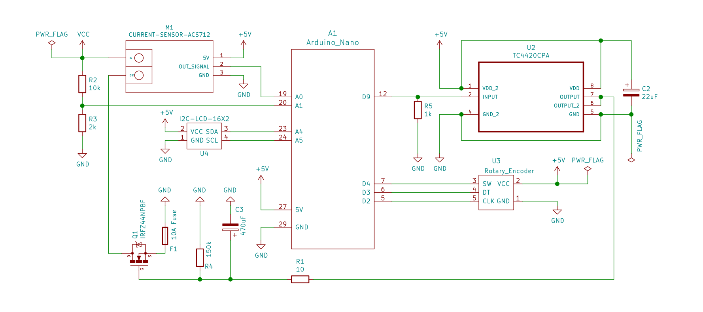
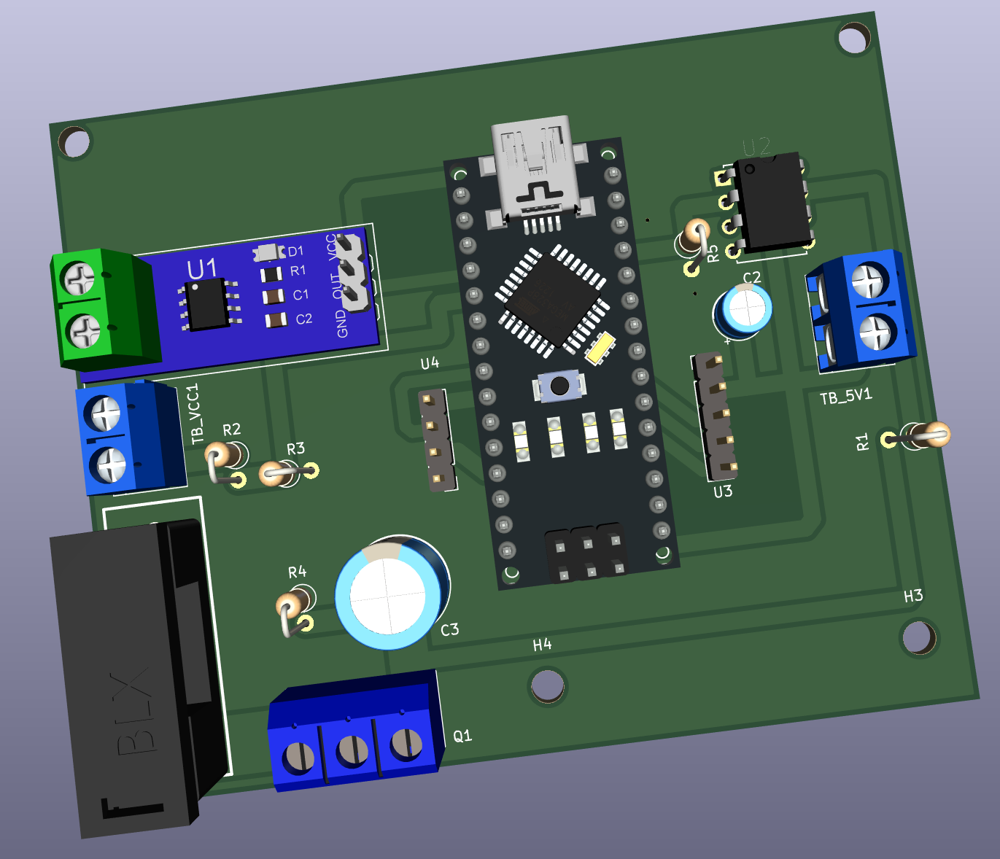

### Variable Electronic Load

This variable electronic load helps with testing power supplies, and batteries.

Motivation: RIGOL DC Electronic Load-DL3021 costs ~50k - this project costs
nothing in comparison, and does the job in typical amateur radio contexts just
fine.

Rating: 20A @ 30V depending upon the heatsink.

Testing notes (Dhiru): I have tested my build up to 5A @ around 20v.

This is an improved version of https://www.instructables.com/DIY-Adjustable-Constant-Load-Current-Power/. All
credit goes to `GreatScott` for coming up with this project.

Note: The 3D renderings are *only* published to help with the manual layout work on
Zero-PCBs. All screenshots are clickable and zoomable.

See `Adjustable-Load-v1.1.pdf` for details.
